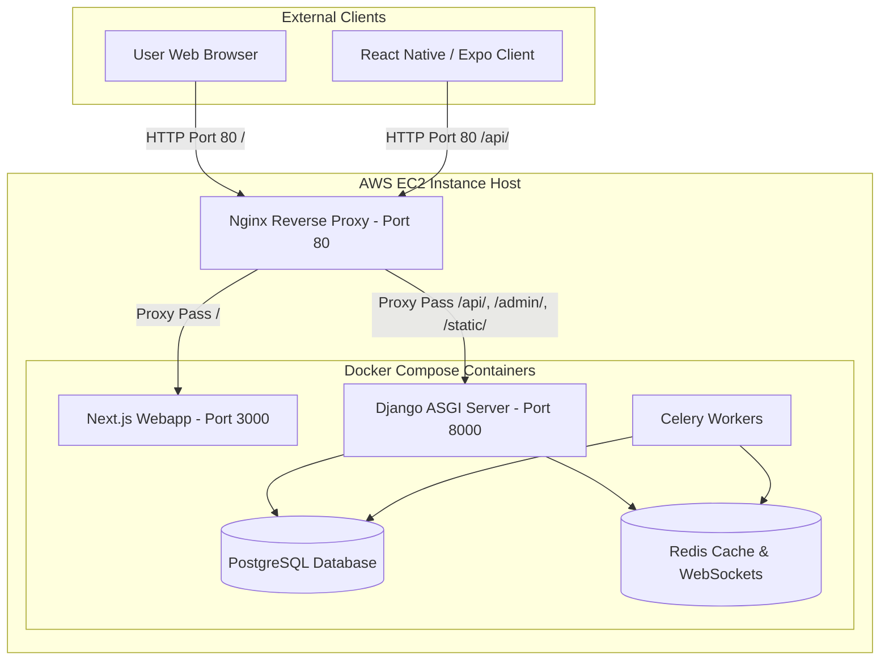

# BCS Preparation Platform

A comprehensive preparation platform designed to help candidates prepare for the Bangladesh Civil Service (BCS) examinations. The platform consists of a backend API service, a Next.js web application, and an Expo-based React Native mobile app.

---

## 🏗️ Architecture Overview

The platform is deployed on **AWS EC2** using **Docker Compose** containers and managed with a **GitHub Actions** CI/CD pipeline. An **Nginx** reverse proxy runs on the EC2 host to route requests.

The system is split into three main components:
1. **Host Nginx Proxy**: Routes incoming traffic on Port 80 (HTTP) to correct containers.
2. **Backend API (`/api`)**: Built with Django 5.2, utilizing PostgreSQL as the primary database, Redis for caching/websockets, Daphne for ASGI runtime, and Celery for background queues.
3. **Next.js WebApp (`/webapp/bcs-web`)**: Next.js 15 client-side application running on Port 3000.
4. **Expo Mobile App (`/bcs_pre_app_expo`)**: React Native client using Expo SDK 56, Redux Toolkit, and NativeWind v4.



---

## 🛠️ Project Structure & Setup

### Prerequisites
Before running the project locally, ensure you have the following installed:
* [Docker Desktop](https://www.docker.com/products/docker-desktop)
* [Node.js (v20+)](https://nodejs.org/) & `npm`
* [Python (v3.11+)](https://www.python.org/)
* [Expo CLI](https://docs.expo.dev/)

---

### 1. 🐍 Backend API (`/api`)
The backend provides a secure REST API and websocket channels for authentication, question banks, practice sessions, exam simulations, and discussions.

#### Tech Stack:
* Django 5.2 & Django REST Framework
* Daphne (ASGI server supporting WebSockets)
* Celery & Redis
* PostgreSQL

#### Manual Setup:
1. Navigate to the `api` folder:
   ```bash
   cd api
   ```
2. Create and activate a Python virtual environment:
   ```bash
   python -m venv venv
   # On Windows:
   .\venv\Scripts\activate
   # On Linux/macOS:
   source venv/bin/activate
   ```
3. Install dependencies:
   ```bash
   pip install -r requirements.txt
   ```
4. Copy the environment template and set up your values:
   ```bash
   cp .env.example .env
   ```
5. Apply database migrations:
   ```bash
   python manage.py migrate
   ```
6. Run the local Daphne server:
   ```bash
   daphne -b 127.0.0.1 -p 8000 bcs_preparation.asgi:application
   ```

---

### 2. 🌐 Next.js WebApp (`/webapp/bcs-web`)
The web portal features three reading themes (Light, Dark, Sepia), size scales, and compact practice layouts.

#### Tech Stack:
* Next.js 15 (Turbopack compiler)
* React 19
* Tailwind CSS (Theme CSS variables integration)

#### Manual Setup:
1. Navigate to the webapp folder:
   ```bash
   cd webapp/bcs-web
   ```
2. Install npm dependencies:
   ```bash
   npm install
   ```
3. Set local environment variables (in `.env.local`):
   ```env
   NEXT_PUBLIC_API_URL=http://localhost:8000/api
   ```
4. Run the development server:
   ```bash
   npm run dev
   ```
5. Build the production build:
   ```bash
   npm run build
   ```

---

### 3. 📱 Expo Mobile App (`/bcs_pre_app_expo`)
A native mobile client offering offline-ready state management and exam environments.

#### Tech Stack:
* Expo SDK 56 & React Native
* Redux Toolkit & Redux Persist (Offline store hydration)
* NativeWind v4 (Tailwind engine for React Native)
* React Navigation v7

#### Dynamic Styling Rule:
> [!IMPORTANT]
> **Dynamic className rendering inside NativeWind v4**: Avoid toggling colors or layout classes dynamically inside Expo code as it forces compiling utility configurations on the fly and triggers bundle re-generation. 
> Keep layouts/borders static and use inline overrides for dynamic states instead:
> ```tsx
> style={{
>   backgroundColor: isSelected ? '#7c3aed' : '#ffffff',
>   borderColor: isSelected ? '#7c3aed' : '#e2e8f0',
> }}
> ```

#### Local Run:
1. Navigate to the Expo folder:
   ```bash
   cd bcs_pre_app_expo
   ```
2. Install dependencies:
   ```bash
   npm install
   ```
3. Launch the Expo bundler:
   ```bash
   npx expo start -c
   ```
4. Scan the QR code using the **Expo Go** app, or press `a` to run on Android or `i` for iOS.

---

## 🐳 Docker Deployment (Full Stack)

The entire backend and frontend stack can be run in seconds using Docker Compose.

```bash
# Build and run all services in detached mode
docker compose up -d --build
```

### Services Mapped:
* **PostgreSQL Database** (`bcs_db`): Port `5432`
* **Redis Cache Layer** (`bcs_redis`): Port `6379`
* **Django API Server** (`bcs_api`): Port `8000` (auto-creates a superuser `admin` / `adminpass` on first run)
* **Next.js WebApp** (`bcs_webapp`): Port `3000`

```bash
# Check container status
docker compose ps

# View service logs
docker compose logs -f
```

---

## 🚀 AWS EC2 Deployment & CI/CD Pipeline

The project is configured for automated continuous deployment (CD) on an **AWS EC2 Instance** using **GitHub Actions** and **Nginx**.

### 1. ⚙️ GitHub Actions CI/CD Setup
The CD pipeline automatically builds and restarts the Docker stack on EC2 whenever changes are pushed to the `main` branch.

To enable the pipeline, configure the following secrets in your GitHub repository (**Settings > Secrets and variables > Actions**):
* `SSH_HOST`: Your EC2 Instance's Public IP address (e.g., `184.192.0.141`).
* `SSH_USERNAME`: Your EC2 user (typically `ubuntu`).
* `SSH_KEY`: The contents of your private SSH key (`.pem` file) used to authenticate with EC2.

The workflow details are defined in [.github/workflows/deploy.yml](file:///.github/workflows/deploy.yml).

---

### 2. 🔀 Nginx Reverse Proxy Setup (Host Machine)
Nginx runs directly on the EC2 host to route external HTTP traffic to the appropriate Docker containers:
* `/` ➡️ Next.js WebApp (`http://127.0.0.1:3000`)
* `/api/` ➡️ Django REST API (`http://127.0.0.1:8000`)
* `/admin/` ➡️ Django Admin Panel (`http://127.0.0.1:8000`)
* `/static/` ➡️ Django Static Assets / Admin styling (`http://127.0.0.1:8000` via WhiteNoise)
* `/ws/` ➡️ Django Channels WebSockets (`http://127.0.0.1:8000` supporting WS upgrade)

#### To configure or update Nginx on EC2:
Run the following commands in your EC2 instance SSH terminal:
```bash
# Navigate to the code directory
cd /home/ubuntu/bcs-preparation-platform

# Pull the latest changes
git pull origin main

# Copy the server configuration to Nginx sites-available
sudo cp nginx.conf /etc/nginx/sites-available/bcs-platform

# Enable the site configuration by symlinking it
sudo ln -sf /etc/nginx/sites-available/bcs-platform /etc/nginx/sites-enabled/

# Remove Nginx default index route (if exists)
sudo rm -f /etc/nginx/sites-enabled/default

# Verify syntax and restart Nginx
sudo nginx -t
sudo systemctl restart nginx
```

---

### 3. 🧹 EC2 Storage & Docker Volume Management
Because standard builds cache heavy intermediate layers, small EC2 server disks (such as 8GB SSDs) can run out of space. 

* The `docker-compose.yml` is optimized for production by omitting local source code/`node_modules` volume mounts.
* The CI/CD pipeline automatically runs a docker prune during each release.
* **Manual Disk Clean Command** (run this if disk gets close to 100%):
  ```bash
  docker system prune -a --volumes -f
  ```

---

### 4. 🪵 Useful Operations Commands (EC2 SSH)
* **Check running containers**:
  ```bash
  docker ps
  ```
* **View backend logs**:
  ```bash
  docker logs bcs_api --tail 50 -f
  ```
* **View frontend webapp logs**:
  ```bash
  docker logs bcs_webapp --tail 50 -f
  ```
* **Check Nginx proxy routing logs**:
  ```bash
  sudo tail -f /var/log/nginx/error.log
  ```

